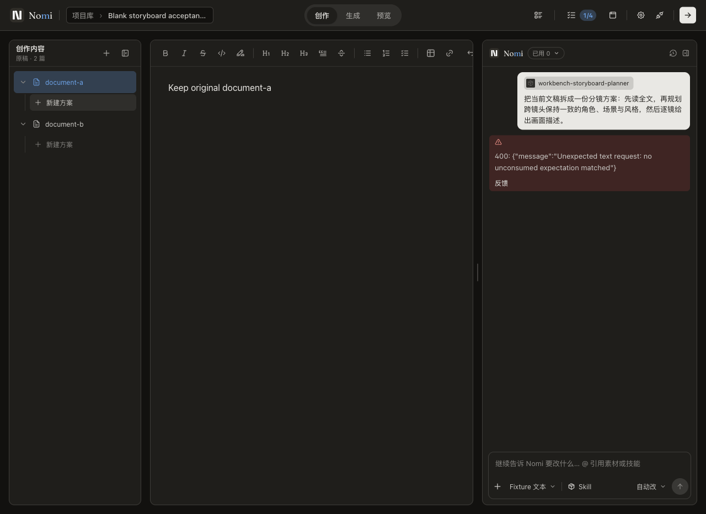
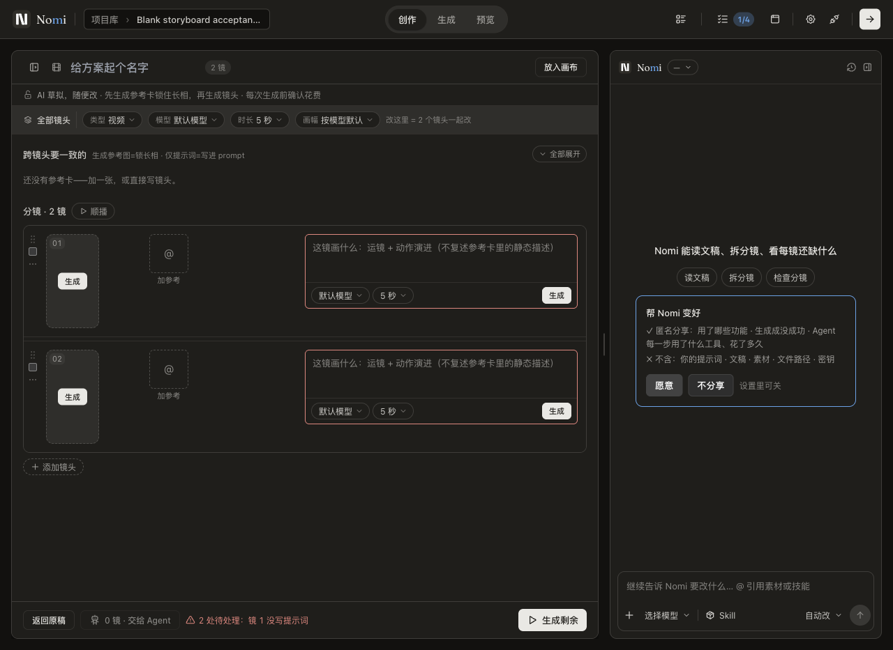
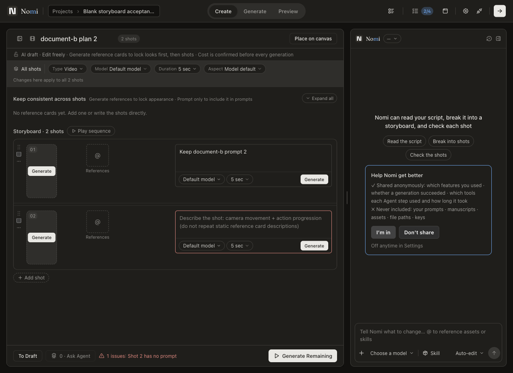

# PR #828 交接：修复检查点，尚未验收完成

本交接按用户要求上传现有代码、测试、截图与资料。PR 保持草稿，不批准、不合并、不发布。不能把本次上传理解为“简化 A + 完整 T7 已完成”。后续人员先读本文件，再核对实际 PR head；不要继承旧正文的全绿结论。

## 范围与阅读顺序

范围冻结为简化 A + 完整 T7：保留原 `StoryboardPlanEditor -> storyboardRowActions -> canvas runner`，接好新建、Agent 目标、保存恢复和节点绑定。不新造页面、执行器、付款流程或第二份可编辑正本，不自动展开 T3。

1. 仓库 `AGENTS.md`、`docs/engineering-rules.md`；修生产问题前读原根因修复 skill。
2. [批准范围原件索引](evidence/core-a-20260920/scope/README.md)及用户文件 `Nomi_simplified_A_plus_T7_original_storyboard_plan_2026-09-20.md`。
3. [本轮工作流证据清单](2026-09-20-core-a-workflow-evidence-inventory.md)：顶部是最新运行，下方是明确标时的历史快照。49 项是验收条目数量，不是通过数量。
4. [复修方案](../plan/2026-09-20-pr828-review-remediation.md)、[Ponytail 26 项处置](2026-09-20-pr828-ponytail-disposition.md)、[T7 技术取舍](../plan/2026-09-20-t7-resource-recovery-decision.md)。
5. [现行验收记录](2026-09-20-core-a-current-acceptance.md)、[随 PR 保存的实测摘要](evidence/core-a-blank-create-20260920/checkpoint-receipts.json)。摘要保留来源报告 SHA-256、原构建身份和失败结果，不是新跑的测试。

## 代码状态与身份

- 分支：`codex/core-a-integration-20260919`；PR：<https://github.com/aqm857886159/Nomi/pull/828>。
- 本次检查点之前本地 HEAD 为 `9cb822c7ad0e952e8df748d3cbb075f12e026da3`，已整合主线 #827；远端旧审查 head 为 `04658ef65c598102a5cb56e7bc09d0d1ea823ee5`。
- 本文件与同次提交的源码共同形成上传检查点。用 `git log -1 --format='%H %T' -- docs/audit/2026-09-20-pr828-handoff.md` 定位其提交和树。文档不自填尚未生成的提交 SHA。
- 最新四条 Electron 旅程来自独立构建：HEAD `9cb822c7ad0e952e8df748d3cbb075f12e026da3`，dirty tree `1a40e09c22497204acb3a565efd02a445b7152ab`。这是实测构建身份，不能改写成上传后的 commit/tree。
- 隔离构建目录 `/private/tmp/nomi-blank-plan-build-20260920`。空白创建所改 sidebar 与 document slice 的 SHA-256 分别为 `1f865b6e240b14cbbda8f9b455f65db6c3a41524eb443b4f6b62c21abb454272`、`5800d3482c72aad80d430fbbeaace17103ccbccb386ebe0586ff2b6479ffa725`，当时与集成目录逐字节相同。

## 当前实现与证据边界

| 改动 | 当前状态 | 不能据此声称 |
| --- | --- | --- |
| 原侧栏手动新建 | 原 `addStoryboardDesign` 本地建空白对象，再选中原编辑器；不触发 planner/模型。仅显式复制才沿原投影落表 | 所有分镜控件与 Agent 异步冲突均已验证 |
| 已批准批次切项目 | 原 confirmation/runner 区分交互身份和持久执行身份，保持原目标变化的拒绝；追加真实正文/选区校验 | 只凭低层后台 runner 通过即可覆盖所有确认入口 |
| 分镜删除撤销 | 原 editor 限定事件归属、可见性、Undo/Redo；局部恢复删除行，保留后续独立编辑；legacy/Run 同边界 | 可以整份覆盖旧方案快照或新建撤销框架 |
| 模型/参考与首帧资格 | 原目录按已发布模式查询；原槽判断计入计划首帧；原批量链继续运行 | 预置方案通过等于用户已通过原控件编辑所有字段 |
| 拖动中断 | 原租约固定原舞台；合法原图结算已应用位移，过期图仅释放 | 合成 blur 等于所有真实 OS 中断组合 |
| Ponytail 建议 | 旧 head 的 26 项中 16 项源码已改、10 项逐条保留理由 | 旧评审已覆盖新检查点或全部建议都不成立 |
| 参数条资源错误隔离 | 两宿主可局部显示错误；真实资源解除阻断后重试仍失败 | 完整 T7 已通过、根因就是最初普通点选不出现 |
| CI 与测试入口 | 补浏览器运行依赖、平台路径边界；修正错误的新建测试预期 | 最终全量门禁或安装包已经通过 |

原主线 `dc113e712` 在作者编辑/显式复制后投影 `shot_table` 是既有功能，不能删掉。手动空白新建瞬间不落节点，后续编辑可以更新原引用表；不得借此创建媒体节点或提交生成。

## 最新实际运行

均为 macOS 构建版 Electron 43.4.1 / Chromium 150，原 UI、IPC 与磁盘，外部供应商为 loopback。本次没有新增真实供应商付费调用；Windows 未验证。

| 原操作入口 | 实际结果 | 限制 |
| --- | --- | --- |
| 侧栏新建四份方案，标题/prompt 编辑，冷重开 | 8 项通过；0 text / 0 image / 0 unexpected | 两文稿预置；未覆盖原新建文稿按钮、同名与所有控件 |
| 原聊天明确委托创建，原分镜编辑、放置/查看、单镜和一镜批量、取消、重开 | 进程 exit 0，13 项通过 | 只有日志，没有独立结构化报告；非真实供应商 |
| 原画布数量 3，批准后切项目 | 16 项通过；恰好 3 wire calls，结果归 A，B 完整图 hash/媒体不变 | 是画布数量 3，不能冒充原分镜行 ×3 |
| 原分镜删除和快捷键，两 host，隐藏后画布 Undo/Redo，再冷重开 | 8 项通过；后续编辑/结果保留，0 text/image/unexpected | 预置 legacy/Run 数据，仅证明其后的原操作边界 |

最近定点检查：lifecycle + 原表投影集成 23 项、typecheck、根因合同 48 项及 38 个高风险文件、walkthrough 检查 46 项通过。定点 ESLint 生产文件无问题；mjs 由现有配置忽略，不算 lint 通过。最新全量门禁、全分支语义审计、最终包及当前付费复验未完成。

失败也保留：旧新建入口产生 0 方案/1 text 请求；修后首次冷重开比较因原迁移补 `renderKind: 'shot-frame'` 失败，后改为显式校验该既有迁移并保留其余完整比较，复跑通过。不能删掉这两份失败记录。

## 阻塞与下一步

1. **T7 资源恢复仍失败。** canvas zh 与 payment en 各有实测失败，构建分别为 `c458c7b78e834f424de6985d62246957560f7325`、`e1d021bb7767575fa36408873bce0ab2fa0c7ef6`。真实 `file://` 资源经 webRequest 拦截为 `ERR_BLOCKED_BY_CLIENT`，解除后原重试没有恢复编辑。静态导入实验扩大失败到工作区，未采纳；安全保存后重载仅评估，未实现、未改变验收标准。不要继续堆 React key、重试次数或自制模块加载器。
2. **按工作流清单补缺口。** W01 原文稿新建/同名；W02 四方案所有原参考、模型、参数、首帧控件；W03-W05 实际 Agent 等待时切目标、改删及乱序回执；C02 同一次 33 选 3 的 quote/grant/实际提交；关闭后剩余批次、过期 quote、unknown 回包恢复；原分镜行 ×3 与参考生成入口。未验证与已证缺陷分别处理。
3. **重新绑定最终证据。** 在新提交构建上核相关原入口及安全拒绝，完成全量门禁和风险相称语义审计，再验证最终包和真实付费边界。旧包/付费产物只能证明旧构建。
4. **审计未闭环。** 旧 474 文件 v6/v7 清单的 hash 匹配仅能筛选复用候选，不等于逐行语义批准。历史未知 `canvas.node.removed` 尚未归因。最终分支 Ponytail 状态以 PR 正文的最新实际结果为准，旧 26 项处置不是新收据。
5. **保留已批准的设计边界。** #808 左栏自动收起保持；展开左栏英文窄屏碰撞已列 `T-DS-01/A-2` 后续设计任务，不能用收起截图宣称展开布局全通过。Agent 顶部不另加挤占空间的分镜信息面板。

根因教训：旧 E2E 把“点击新建后发起 Agent 请求”写成正确预期，实测了错误语义。补测必须先从批准任务写用户结果和禁止副作用，再对照测试入口；不能 mock 掉正在修的边界、预置成功结果或从当前实现推导预期。`core-a-creation-runs` 已改走原聊天明确委托；同类付费 projection 旅程也改入口，但本轮未运行，不记通过。

## 复现入口与本机注意

从独立构建工作树执行，先核对 `dist/build-stamp.json`；不要在用户运行中的原目录覆盖 dist。以下脚本使用隔离数据，具体 fixture 范围见各脚本与证据清单。

```sh
node tests/ux/core-a-blank-storyboard.e2e.mjs
node tests/ux/core-a-creation-runs.e2e.mjs
NOMI_BACKGROUND_MODE=variants node tests/ux/project-switch-background-run.walk.mjs
node tests/ux/core-a-storyboard-undo.e2e.mjs
NOMI_T7_LOCALE=zh-CN node tests/ux/core-a-t7-recovery.e2e.mjs
NOMI_T7_MODE=panel NOMI_T7_LOCALE=en node tests/ux/core-a-t7-recovery.e2e.mjs
```

用户真实数据预览仍是旧 tree `7eed1f2be9781b3ce8721138b49c5524a521e947`，不含新空白创建修复。本次上传不重启它。真实 profile 为 `~/Library/Application Support/nomi`，项目为 `~/Documents/Nomi Projects`；既有备份 `~/Desktop/Nomi-backup-before-core-a-20260920-2233`。接手前重新确认进程，不凭历史 PID 停进程、刷新窗口或碰用户项目。

## 差异规模

上传前已提交分支相对 `origin/main...HEAD` 为 423 文件、+64,165/-2,740；其中生产代码 176 文件 +5,079/-2,066，测试 +8,549/-590，文档约 49,794 新增行（约 78%，主要为两份审计 JSON 和根因门表）。该数字不含本检查点的未提交增量。体量不能证明质量，也不能为追求数字缩小而删除失败证据、保护测试或必要绑定。最终文件数以实际 PR diff 为准。

## 截图





其余 [Agent 原编辑器结果](evidence/core-a-blank-create-20260920/agent-original-editor-result-en.png)与[切项目后原项目三结果](evidence/core-a-blank-create-20260920/variants-original-project-result.png)随同上传；这些是对应旅程截图，不是所有布局状态的验收结论。
