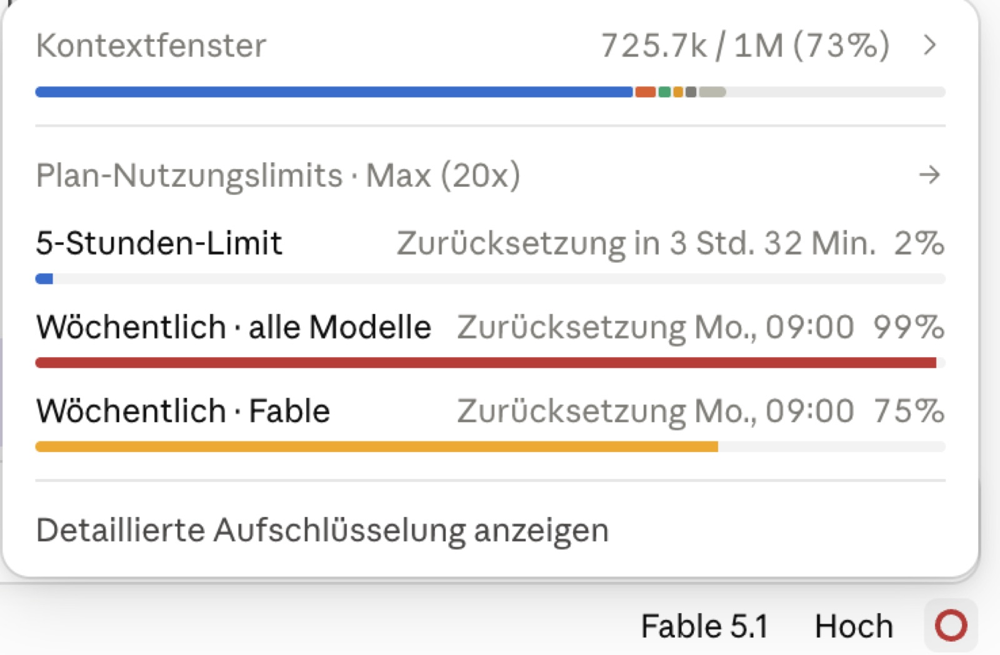
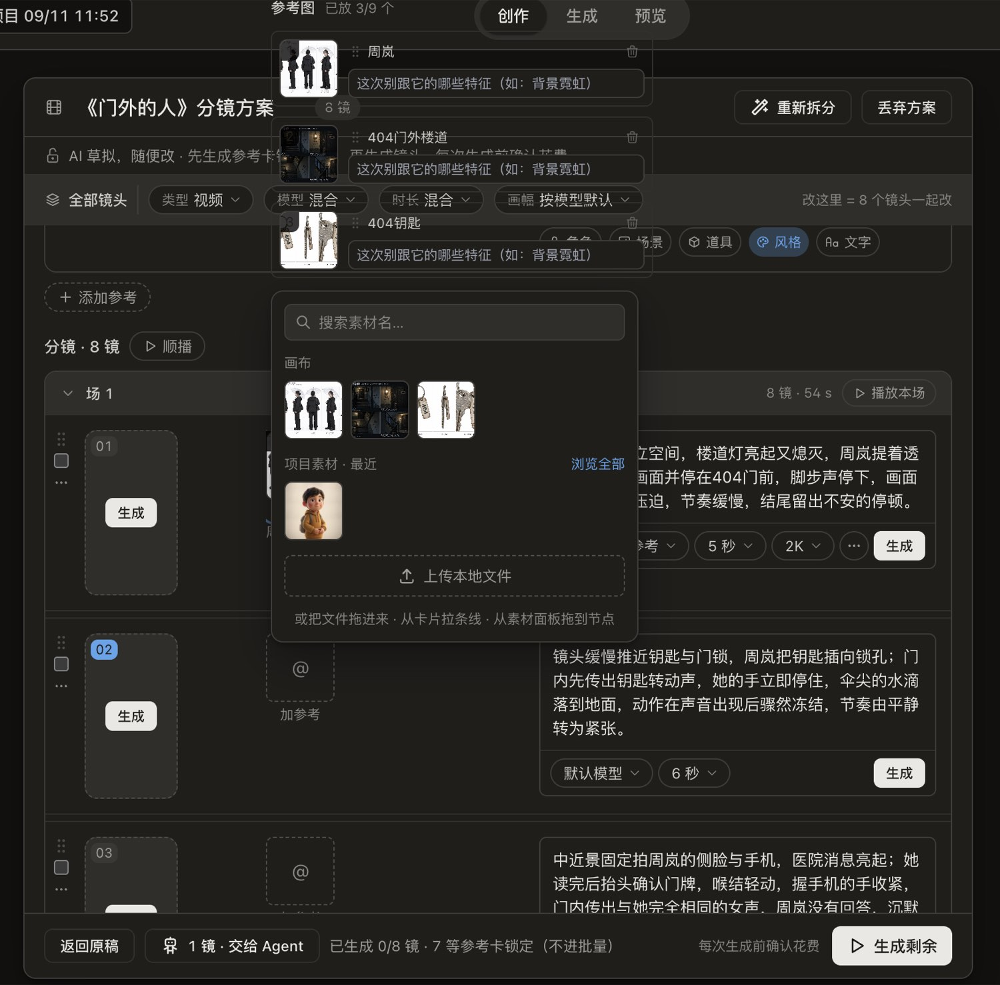
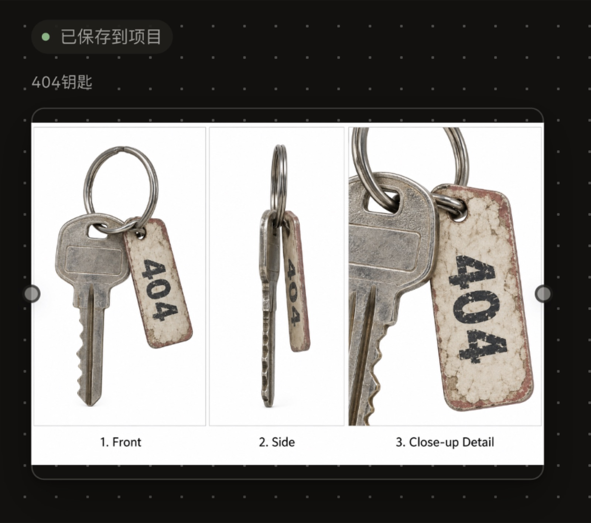
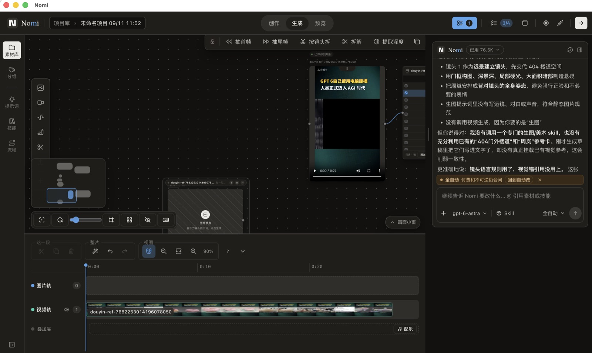
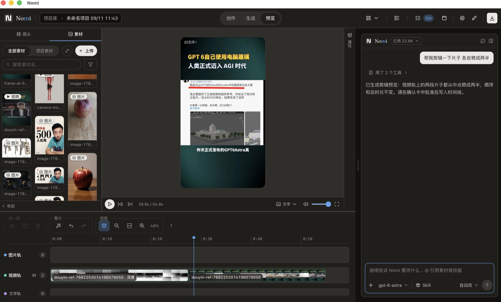
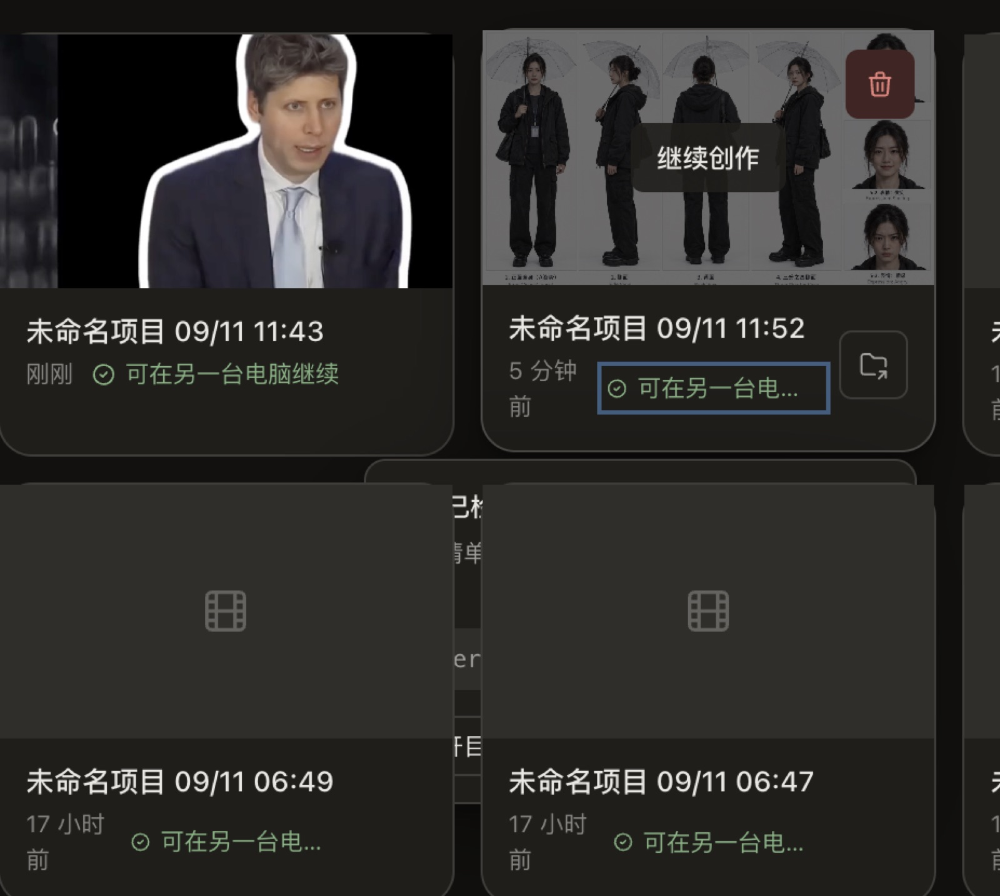
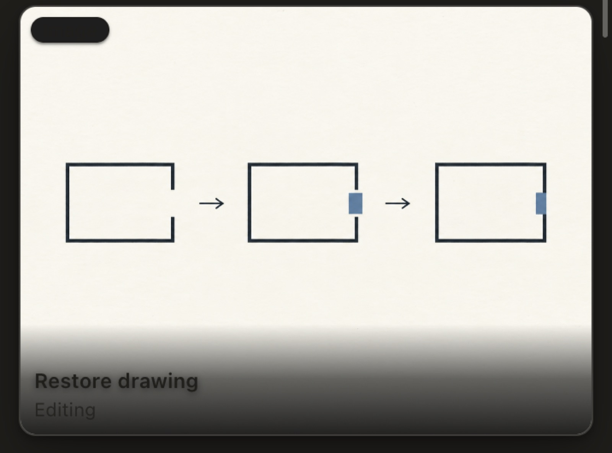
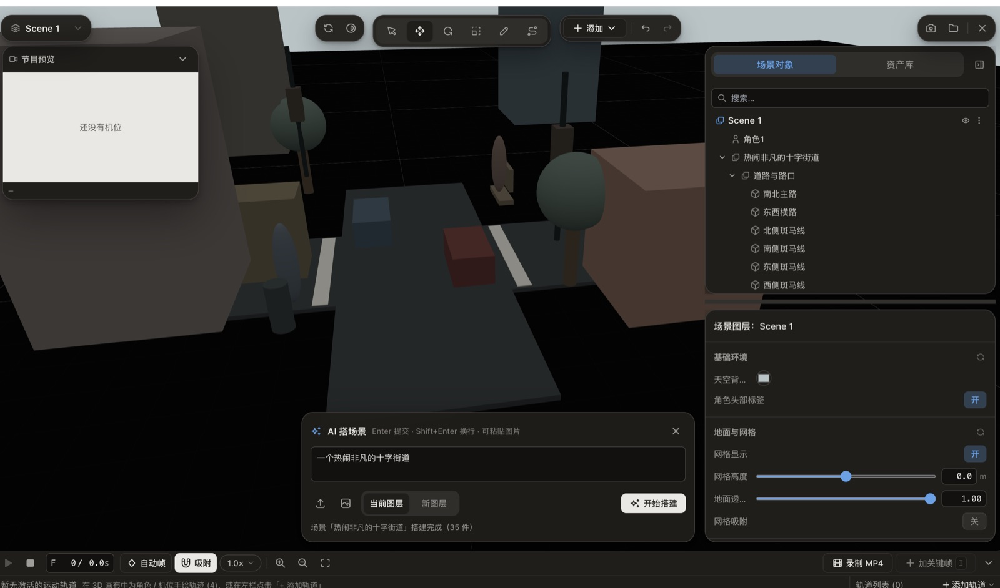
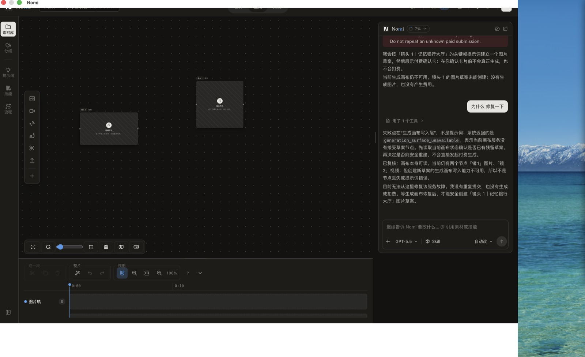

# 原始资料 · 微信文件传输助手 09-10 → 09-14（全文）

> 状态：📎 交接/日志 — 这是**原始资料**，不是方案，不要改它的内容。
> 归并后的版本见 [同批梳理](2026-09-14-filehelper-digest.md)；由它派生的待办见 [TODO](../TODO.md)。

**来源**：本机微信 `filehelper`（自己发给自己的备忘）会话，2026-09-10 02:09 → 2026-09-14 01:52，共 82 条（59 文字 · 19 图 · 4 文件卡）。本文按时间原样保留 **81 条**，只删掉一条纯闲聊（09-10 03:28 的「色色发抖」）。**文字一字未改**，错字、重复段落、别的 AI 贴进来的整段结论都原样留着——那些重复本身就是信息（同一件事说了两遍＝他真的在意）。

**图片**：19 条图片消息里有 9 张能在桌面找到原图，已缩到长边 1600 / JPG 存进 [`screenshots/`](screenshots/) 并内联在对应位置；其余 10 张本机没有原图，只标一行「本机无原图」。
**图片对位的一处不确定**：09-12 00:45 那批一次发了 5 张图，而桌面只有 4 张同段时间的原图（采集于 00:06 / 00:27 / 00:33 / 00:43）。我按**采集时间顺序**配上去，并用截图里看得见的内容做了交叉验证（8 镜卡、已保存到项目、劈成两半确认卡三张对得上）；第三张（00:33）对应哪条文字**不确定**，可能差一位。00:46 / 00:47 / 09-12 02:05 / 09-13 19:27 四张是逐条对上的，确定。

**文件卡**：4 个附件（两份 Agent 转录 jsonl、一份诊断包 zip、一份 index.md）只留文件名，内容不入库——转录里有创作内容与本机路径。台账见 [digest 第五节](2026-09-14-filehelper-digest.md)。

---

## 09-10

**[00] 09-10 02:09**

> 1.建立轨迹日志 2.速度很慢 3.都是文生视频 没有弄真实参考 4.分镜头生成无反馈 5.创作区域三栏设计 目前三栏设计各不相同 不搭配 不统一 6.分镜区域出现加载失败 7.分镜头左上角和右上角徽标看不清

**[01] 09-10 03:28 · 图片**



> Claude 额度面板（不是产品截图，只是当时的上下文）

**[03] 09-10 04:28**

> 看一下拦截这部分 核心的问题很简单就是别执行一些愚蠢的命令 比如 删了我的电脑文件什么的类似的东西

**[04] 09-10 04:30**

> 压缩策略 【agent日志记录】

**[05] 09-10 13:45**

> 1.提示词部分有英文 英文存在需要仔细截图查询
> 2.时间轴无法向下缩 右上角的功能栏和下面有遮挡

**[06] 09-10 13:45 · 图片** — 本机无原图（`📷[图片] md5=3114958940e4`）

**[07] 09-10 13:45**

> 3.nomi的栏有空间浪费 在生成区域和预览区域可以充满页面 或者尽可能减少空间浪费
> 4.apimart写入key没有和以前一样一次性打开所有模型 而且模型列表不知道去哪里了 但其实已经可以用了 但是列表没有 AI侧也没法选择 现在只能验证 而验证一直处理之后 直接全部失败 之前我们说过要测试通过mcp链接 这部分可能需要处理
> 5.左侧工具栏鼠标 hover上去加号无法点击到后面的节点 
> 6.一次只能选择一个skill 且skill不会随着聊天发出 让我以为这个skill一直没有被使用 一直有问题 
> 7.agent聊天框换行可以变大 但是一直写字不会 发送按钮和发送左边的模式按钮会突然移动到左边 本来在右边 点击了模式选择之后 点击其他界面地方无效 必须点击原来的按钮才能让点出来的界面下去 同样一个聊天 不知道为什么分成3段回复

**[08] 09-10 13:45 · 图片** — 本机无原图（`📷[图片] md5=b476ad82051c`）

**[09] 09-10 13:45**

> 7.权限控制问题 我让他生成6棱柱的图 首先是模型没有按照默认选择 然后他没有问我 我都没看参数什么的 直接做完了
>  8.框选画布节点 有明显的卡顿感
> 9.提示词框输入@没有反应 素材库的素材也无法拖入（画布、prompt框）
> 10.点击节点 下面的输入框来回漂移 不在我的节点下面 而且存在有时候被截断的问题

**[10] 09-10 13:45 · 图片** — 本机无原图（`📷[图片] md5=11644ebe4512`）

**[11] 09-10 13:45**

> 以及参数挤在一起 而且agent说创建好draft 但是不在画布里面 点击任务栏里面的东西 出来的参数框里面的模型和提示词根本不对应
> 11.视频节点 但是后面显示几个图片 这里应该是选择生成几个对应的东西 图片对应图片 视频对应视频 音频对应音频你可能需要一个通用 的比如 ×1 ×2 类似的东西
> 12.节点下面的东西太多了 可以看怎么整合优化 比如 只写icon hover上去显示具体名称 比如 简化 合并等等 运镜和更多什么的可以放到右上 下面就只放更多和模型生成相关的东西 
> 13.下面的时间线会随着右边的agent左右变动 会遮挡左侧的东西

**[12] 09-10 13:45 · 图片** — 本机无原图（`📷[图片] md5=bc7c2b1836d1`）

**[13] 09-10 13:45**

> 14.左右的拉环依然在pr里面 没有弄上去
> 15.生成按钮 和 生成按钮左侧的模式按钮位置有问题

**[14] 09-10 13:45 · 图片** — 本机无原图（`📷[图片] md5=84d9e26ed137`）

**[15] 09-10 13:45**

> 16.常用的文本节点也放入了加号里面了 
> 17.资产库里的素材和剪辑区域的交互也没有了 这和我们以前的都不太一样啊

**[16] 09-10 18:56**

> pr合并 节点磁吸把手，属 PR fix(canvas): restore magnetic hover handles and side snapping #656（待合并），本轮不重做 节点磁吸把手 以及 一些现在pr里面一大堆pr 主要很大的导演台也得记得合入 这些都挺重要的 以及我们有一些计划还没完成 有一些设计还没落地

**[17] 09-10 19:25**

> 我觉得是不是可以梳理一下agent的我们的这些区域的链接 画一下架构 我觉得这次问题可能是从架构上延伸出来的问题 当然我也不太知道具体的 就是一个想法  pr合并 节点磁吸把手，属 PR fix(canvas): restore magnetic hover handles and side snapping #656（待合并），本轮不重做 节点磁吸把手 以及 一些现在pr里面一大堆pr 主要很大的导演台也得记得合入 这些都挺重要的 以及我们有一些计划还没完成 有一些设计还没落地

**[18] 09-10 19:43**

> 声音节点连接不了视频节点不对吧，我有固定参考声音怎么办？最近用户反馈很多声音节点的相关问题 比如 链接不上视频节点 有些视频是可以参考音频的 比如 seedance2.0 另外现在的音频模型不太多 可以看看更多接入 以及b站有人反馈 comfyui 音频输入用不了 一些其他用户反馈 1. Alt+鼠标拖动 可以复制节点。
> 2.Comfyui节点一开始可以设置参数，确定后，后面不能再改工作量的参数了。API如果有2家的时候，我现在选好了Nebula，当我切换一次其他的模型，再切回来之后，就会跳回默认的ApiMart；能否设置记住最后一次的设置状态。我从来不用这两个（值得是即梦会员视频模型），但是一直占着位置
> 另外这些节点 能增加设置排序的界面吗
> 嗯呢 哈哈哈哈
> 常用的放前面，不常用的 可以手动设置往后排。

**[19] 09-10 19:43**

> 另外就是目前有些设计有问题 比如 我们的拆解视频 太离谱了 设计的没法用 这个我们有了设计 只是需要去执行


## 09-11

**[20] 09-11 02:03**

> 我觉得是不是可以梳理一下agent的我们的这些区域的链接 画一下架构 我觉得这次问题可能是从架构上延伸出来的问题 当然我也不太知道具体的 就是一个想法  pr合并 节点磁吸把手，属 PR fix(canvas): restore magnetic hover handles and side snapping #656（待合并），本轮不重做 节点磁吸把手 以及 一些现在pr里面一大堆pr 主要很大的导演台也得记得合入 这些都挺重要的 以及我们有一些计划还没完成 有一些设计还没落地
> 声音节点连接不了视频节点不对吧，我有固定参考声音怎么办？最近用户反馈很多声音节点的相关问题 比如 链接不上视频节点 有些视频是可以参考音频的 比如 seedance2.0 另外现在的音频模型不太多 可以看看更多接入 以及b站有人反馈 comfyui 音频输入用不了 一些其他用户反馈 1. Alt+鼠标拖动 可以复制节点。
> 2.Comfyui节点一开始可以设置参数，确定后，后面不能再改工作量的参数了。API如果有2家的时候，我现在选好了Nebula，当我切换一次其他的模型，再切回来之后，就会跳回默认的ApiMart；能否设置记住最后一次的设置状态。我从来不用这两个（值得是即梦会员视频模型），但是一直占着位置
> 另外这些节点 能增加设置排序的界面吗
> 嗯呢 哈哈哈哈
> 常用的放前面，不常用的 可以手动设置往后排。
> 另外就是目前有些设计有问题 已经发现问题除了设计方案了 比如 我们的拆解视频 太离谱了 设计的没法用 这个我们有了设计 只是需要去执行
>
> 桌面路径：Nomi-竞品研究方案包-20260909/docs/plan/2026-09-09-competitive-response-plans/ 做了一些产品的调研 是对于我们的本身剪辑方面的综合提升
>
> 另外也有对于竞品的相关调研 可能也需要补齐这部分能力

**[21] 09-11 21:56**

> 9.74 复制打开抖音，看看【喜公子拍点啥的作品】《AI：你别动，我替你跳》 # AI # AI玩法... https://v.douyin.com/Ke0CmlDzbTw/ K@J.Ii 04/15 :0pm JVy:/ 


## 09-12

**[22] 09-12 00:45**

> 1.门岗按风险分档。普通 PR 本地只跑「契约门岗 + 改动相关的测试」，大概 5 到 8 分钟；全量一万两千个测试交给 GitHub 的 CI 跑，那边是并行机器，不占你电脑的锁。你的规则 R22 本来就是这么写的，只是 pnpm run gates 这个命令一直跑的是全量。改这一处，队伍从「30 分钟一个」变成「6 分钟一个」，今天这种 18 个排队的局面就是两小时的事。
> 2.优化导演台用户体验 
> 3.agent部分  读取文稿失败 surface_port_unavailable Next: Read the current surface again and use its current identifiers and revision before retrying. 一直重试让我确认 过程中有文字卡顿  然后让我运行命令 但里面感觉都是废话 而且一直重复问我 运行命令当前作品

**[23] 09-12 00:45 · 图片**



> 分镜方案面：8 镜卡 + 「添加参考」浮层压住镜头行

**[24] 09-12 00:45**

> 点击复制icon 没有反馈 但是已经复制了 结果 创作区文档有锁冲突。我换个方式——用之前对话里看到的项目目录结构，直接写到项目文件里：  他没有直接调用skill 现在skill的机制是什么 他是可以被调用的吗 让他做分镜 生成了列表 里面是8个镜头卡 首先是无法取消 只能确认 收起icon无效 而且无法滑动对话框 另外上面只有秒数和被截断的文字 不直到在干嘛  点击对钩无法取消那个镜头 到了分镜 执行计划无法删掉 很冗余 下面的生成按钮点击了之后 生成中的文字很模糊 似乎是同一个颜色的 看不清 也没有反馈 跨镜头一致的图片和提示词似乎不太一致 感觉不太像 但是也差不多 这里我不确定 你可以查一下是不是有问题 上面显示的是竖屏比例 生成出来的图片却是横屏的 有点离谱  下面的角色场景什么的icon有什么用 这不是确定好的嘛  点击第二个跨镜头一致的开始生成了 但是这个时候点击第三个没反应 是不能并行吗？快镜头的生成好了 但是在下面参考框里面没有看到 自己加入参考图 点击之后怎么悬浮在文字上 有图片

**[25] 09-12 00:45 · 图片**



> 画布节点：三视图产物 + 左上「已保存到项目」提示

**[26] 09-12 00:45**

> 而且参考图左上角似乎有标签 但是看不清 第二张图也是黑的 右下角的标签页看不清 模型脱离了模型框 显得很丑 为什么点击01和02是选中 而点击表格左侧的小icon却是跳过 换了画幅 但是所有的都换了 模型参数也不够 minimaxh3里面竟然不能选画幅 点击首帧模式 竟然也有两个小框 最下面的统一模型有点搞笑了 因为图片和视频不一致 上面一批图片下面一批视频 现在这个设计把所有模型堆在一起了 点击移到场 这个不太理解 原来是场分了一下 交给agent没反馈 这个是不是可以删掉 锁定好像也没用 是不是可以删掉 画布里面有了分镜方案 但是为什么他那里是关键帧 而不是生成的视频 可能也行吧 意思这里不播放是吧 时长太宽了占空 参考曹截断了都 点击仍要生成没反应 而且我是全自动的模式 为什么他不直接给我生成 付费卡 用了一个电影分镜skill 但是他和我生成出来的东西提示词一看就不对 而且比例不对 另外就是画布里面的图片为什么比例不对 上下有透明边 而且所有显示已保存到项目 这是废话啊 右下角的拖动比例拖动很卡 不知道为什么 单击之后才有蓝色拉环 不单机就无法触发

**[27] 09-12 00:45 · 图片**



> 画布＋时间轴＋Agent 面板；Agent 自述「镜头语言规则用了、视觉锚引用没用上」

**[28] 09-12 00:45**

> 去素材库搜索视频 出来的封面都图片有问题 skill也有类似的问题 图片不加载 视频加载进来点击拆解 结果全部失败 秒数也离谱 为什么那么多小数字

**[29] 09-12 00:45 · 图片**



> 预览/剪辑面：Agent 说「已生成剪辑预置…请在确认卡中批量写入时间线」，宿主没出卡

**[30] 09-12 00:45**

> 点击生成一镜 出来的为什么是图片节点 而且提示词都没有 不小心点了下面的时间轴 收不回去了 本来我记得可以收回 而且排版都错了 怎么右下角缺了一大块 本来不是他在右面通过去吗 另外就是拉上来太大了 这里核心是拖动后面可以预览 主要有两个轨道 一个图片一个视频可以预览就行 点击提取深度 没有问我确认 直接开始下载模型 另外为什么出来一个图片节点和提取深度没关系啊 而且下载模型卡住了 原来的视频节点变成黑的了 没法播放了 而且突然很卡 所有的图片都变成黑的了 过了一会好了 出来深度视频了 不知道为什么穿件了视频节点 点击还没反应 过了一会有反应了 我说的反应是指下面有参数框了 进入预览界面 素材无法拖入 我让他剪辑 劈成两半 他说让我弄确认卡 可是依然是那个问题 我不是给他自动改的权限吗 这个不是可以反悔吗 又不是花钱 而且他没有给我劈成两半

**[31] 09-12 00:45 · 图片** — 本机无原图（`📷[图片] md5=cc59dbe2edc2`）

**[32] 09-12 00:45**

> 4.素材库的素材拖不到画布里面
> 5.AI策略里面精简 删掉默认模型 把模型默认为上一次他的选择 允许的供应商和允许的模型删掉 他接入的时候应该就是确认的 让他可以在接入的时候取消某个模型 模型里面 问题 现在点入供应商里面的模型 出现一个大的页面 这个页面首先是可以在设计上优化的 太多线条什么的了 另外我有点疑惑的是 既然已经接入了 这个页面是做什么的 有没有优化的地方 和精简的地方 关于这里的分项
> 6.自动化与权限里面 默认制作模式是不是可以删掉 支付与风险边界是不是可以删掉 AI链接mcp 明显我都没有那些 它显示直接可以链接 另外 下面为什么又有可信发起方 AImcp链接好之后 下面这个就没啥用了吧
> 7.能不能设计一些直接可行的反馈 比如agent出现报错重试 他就可以把日志信息直接反馈给我们提交 又比如生成失败什么的等等

**[33] 09-12 00:45 · 文件卡** — `index.md`

**[34] 09-12 00:45 · 文件卡** — `2026-09-11T03-52-44-844Z_01a08e98-aa2c-746b-8036-68238c889e59.jsonl`

**[35] 09-12 00:46 · 图片**



> 项目库卡片：「可在另一台电脑继续」徽标换行挤在卡片下沿

**[36] 09-12 00:46**

> 点击可在另一台电脑编辑 结果框在下面

**[37] 09-12 00:47 · 图片**



> 技能卡：左上角黑胶囊角标在浅色封面上看不清

**[38] 09-12 00:47**

> 角标看不清

**[39] 09-12 00:48**

> 既然skill吧提示词都放进去了 我们是不是可以看怎么整合提示词和skill了

**[40] 09-12 01:01**

> 选中60个图片拖动组就开始特别卡了 拖动鼠标都不行 性能优化优化过但是还是不行

**[41] 09-12 01:07**

> 编组之后 点击空白屏幕 框就没了 框也没有拉环 拉环也是容易丢

**[42] 09-12 01:08**

> 列表式的排列skill 感觉有很大的空间浪费 不符合排版基本原则

**[43] 09-12 01:26**

> 这是一次正式的复盘 + 调研 + 根因方案任务。我按仓库纪律来：先读 store 锁的真实实现拿根因证据，再做近邻调研，最后落成文档（轨迹/复盘/方案），能修的顺手修。
> 根因证据链已经拿到。按 R5/R6 做近邻调研（业界怎么做「接入验证」的质量与效率），然后落文档：
> 调研有料了（业界共识：**并行 + 每模型超时 + 部分成功语义 + 单模型重测**，LiteLLM/tokenhub/model-check 都是这个形状）。现在落两份文档：近邻调研 + 复盘/根因/方案：
> 按仓库惯例把方案挂进 plan 索引：
> 复盘和调研都落成文档了（已挂 `docs/plan/INDEX.md`），核心结论：
>
> ## 轨迹与复盘（`docs/plan/2026-09-11-mcp-integration-quality.md`）
>
> - **全通**：gpt-image-2（生图）、gpt-5.5、gpt-6-astra（文本）三模型真机接入 + 真实调用验证 completed，两次人类闸门（安全页贴 key、付费确认卡）都真实起效
> - **六步协议本身是对的**，坏的集中在验证 run 的失败路径，按严重度排了 7 项
>
> ## 根因（锁只是放大器，无兜底的状态机才是根）
>
> ```
> 某模型验证失败/超时
>   → finishWithError 写盘 → store.mutate 文件锁 3s 自旋拿不到（store.ts:302）
>   → 抛异常，但 process() 是 fire-and-forget（service.ts:269，无 catch）
>   → 未处理 rejection，状态机永久停在 certifying，cancel 被拒，错误原文丢失
> ```
>
> ## 根本方案（分层，各带验收门）
>
> - **P0**：失败路径不可破坏——`executeRun` 补 catch、终态写退避重试 + 旁路 errors.jsonl + 启动补偿、审计锁是否跨 await 持有
> - **P1**：自愈 + 逃生口——certifying 允许 cancel（AbortController 已存在，只是没接）、启动/周期 reaper 强制终态化超时 run、错误原文进 session read
> - **P2**：效率——文本验证并行化（每模型 30s 超时）、部分成功即部分晋升、「仅重试失败模型」
> - **P3**：观测——目录刷新、lessons 沉淀、技能补操作手册
>
> ## 调研（`prior-art.md`）
>
> 近邻全是同一个共识：**TokenHub** 并发探活每探测 10s 独立超时 + 三态健康降级；**OpenClaw/Beluga** 最小请求（max_tokens=1）+ 逐模型 30s 并发 + 单模型重测；**model-check** 逐次结果持久化带错误原文。Nomi 已有部分晋升的底子，缺的是「失败路径可靠性 + 并发 + 逐模型语义」。
>
> 要动手的话，顺序是 **P0 → P1 → P2**，P0 是一天内的小改但把「卡死」这类事故整个消灭。你说开工我就按仓库纪律开分支写码（连 root-cause 合同一起）。mcp接入模型轨迹

**[44] 09-12 02:20**

> 导演台的基本使用教学 在我进来的时候，我不知道该怎么用，导致我不知道键盘那个WASD是它能够移动这个东西。一些问题 ：输入 一个热闹非凡的十字街道 输出：确实很差的体验

**[45] 09-12 02:20**

> 能不能从功能和逻辑上说明到底该怎么使用

**[46] 09-12 02:38 · 图片**



> 导演台 3D 场景 + AI 填场景输入「一个热闹非凡的十字街道」

**[47] 09-12 14:34**

> 对，第二个 feat/agent-tool-face-20-verbs-20260911 是这三个里最难、风险最高的。
>
>   原因是它不是单点修复，而是一次跨层重构，涉及：
>
>   - Agent lane 的工具分发；
>   - capability registry；
>   - MCP projection；
>   - 20 个 verbs 的定义；
>   - 旧 verbs 删除；
>   - renderer / canvas / document / timeline / production 各类调用；
>   - 工具协议和测试基线。
>
>   三个分支的执行方案我已经清楚：
>
>   1. fix/deconstruct-spend-grant-class
>
>   先做调用 census，列出所有 runTask() 调用和是否带 grantId。然后从“拆解”入口统一取得一次 spend grant，穿到：
>
>   - 每镜头视觉分析；
>   - 转写；
>   - callJudge 评审。
>
>   再修：
>
>   - 吞掉额度/鉴权错误的问题；
>   - streamTextTask 错误返回；
>   - finishReason 丢失；
>   - shot timeline 的最小镜头长度。
>
>   最后跑真实短视频、截图和门岗。这个分支的核心是付费链路和错误可见性。
>
>   2. feat/agent-tool-face-20-verbs
>
>   先不直接提交 46 个未提交文件。执行顺序是：
>
>   1. 对比当前 main 和分支，找出旧 verbs 到新 verbs 的映射；
>   2. 确认唯一 owner 是哪一层；
>   3. 检查四类入口：lane、MCP、capability registry、renderer；
>   4. 逐个确认 20 个 verbs 都能注册、投影、分发、执行；
>   5. 检查旧 verbs 是否真的删干净；
>   6. 跑工具协议、MCP、agent runtime 和类型检查；
>   7. 拆成按目录/职责的多个提交，避免 Ponytail 审查超限。
>
>   这个分支的核心是让模型面对一套稳定、少而清晰的工具接口，不能只看 diff 大小判断完成。
>
>   3. fix/canvas-lod-screen-size
>
>   先确认当前未提交的 1 个文件和已有提交是否完整，然后重点验证：
>
>   - 60 / 150 / 300 节点；
>   - 缩放；
>   - 组框拖动；
>   - 300 张图全选拖动；
>   - 长任务次数和最长帧。
>
>   如果“长任务从 249 降到个位数”的硬指标没达到，就不能宣布完成。这个分支的核心是大画布实际操作不卡顿。
>
>   所以答案是：**目标、依赖和验收路径都清楚；第二个最难，必须先做结构审计再动代码。**目前我会先让它进入只读结构审计，再开
>   始分批修改。

**[48] 09-12 15:38**

> 用户反馈 默认加入运镜很难受啊，因为运镜方式一般自己会写在提示词里面，这个怎么才能呢个不把运镜方式加进去。这个地方分析一下 首先查一下是不是自动加入 如果不是的话 得设计反馈来验证用户是否使用 同时看是不是可以删掉 省掉这个问题


## 09-13

**[49] 09-13 05:42**

> 一次lesson 构建测试系统有多重要 这次的问题-第一次用真实素材的结果已经暴露出一个比 FPS 更严重的问题：即使只有 S 规模（24 张图片 + 24 个视频节点），应用在 20 秒内都没有进入画布，三个动作全部卡在打开项目阶段。 该如何构建原则来指导之后的测试系统构建

**[50] 09-13 06:54**

> 真实测试 用computer use 点开应用做完整的case测试

**[51] 09-13 06:54**

> 只认正确分支的真实应用 + 真实页面输入 + 真实工具轨迹”

**[52] 09-13 19:12**

> 1.模型那里 底下显示已有预制地址模型 但是没有列表 我不知道适配哪些模型
> 2.logo和真实产品不一致
> 3.默认模型策略下面的东西是不是可以删掉 是冗余 以及系统prompt 以及 自动化与权限是不是可以有部分删掉 默认操作模式和模式选择冗余 之处和边界和模式选择冗余 可信发起方和上面的链接是不是冗余 以及链接 AI助手链接mcp这部分要做分析 是不是真实链接 因为我都没有pi 怎么能够链接 以及 如果其他怎么链接 我记得我做了都可以连接的 而不是只是这几个可以设置交互 让不在列表里面的也可以链接

**[53] 09-13 19:12 · 文件卡** — `nomi-diagnostics-2026-09-13-11-12.zip`

**[54] 09-13 19:13**

> agent轨迹数据收集

**[55] 09-13 19:13 · 文件卡** — `2026-09-12T22-37-40-455Z_01a097c4-ece7-71a6-a944-8514fa2ed783.jsonl`

**[56] 09-13 19:27 · 图片**



> 页面被切割（右下缺一块）＋ Agent 报 generation_surface_unavailable / "Do not repeat an unknown paid submission."

**[57] 09-13 19:27**

> 打开右侧AI栏和中间的时间轴之后 页面被切割

**[58] 09-13 19:28**

> 一些设计 右侧AI顶到最下面 吧空间留给AI

**[59] 09-13 19:32**

> 输出过程中点击停止 无法停止 必须等输出完毕

**[60] 09-13 19:32**

> 点击输出后面的粘贴和重试没有反应

**[61] 09-13 19:38**

> 设计这种类似的，当用户遇到问题之后呢，一个快速的一个反馈机制，比如说他遇到一个问题，然后有一个小的，在他遇到问题这个这这个附近或者怎么样，有一个小的弹窗，然后说快速反馈给开发者，然后为了就是要给他，就是要要要要说的这个营销语是说让他愿意去这个反馈，对。然后并且他可以检查我们反馈上不去的一些信息，所以说我们要做一些信息的筛选，对，信息的过滤。然后整个的逻辑是加速我们的这个迭代，所以说我们后台设计一个Agent的轨迹，就是让他一进来，在他使用Agent的之前说我们是用这个轨迹，然后来去优化，发现问题去优化功能，迭代产品，对。然后这个是有很多帮助，等类似的东西。然后如果说他过程当中就直接的这个反馈就有这种直接的一种反馈，能够反馈到反馈到我这边。这是一个很重要的设计，并且后续可能维护，可能是我们能够想到去用一些数据去这个tra-一个model是吧？对，这是一些重要的点，对。

**[62] 09-13 19:42**

> 能拿到数据的同时不影响用户隐私

**[63] 09-13 19:46**

> 如何构建benchmark去评价 输出 剧本 资产 分镜 提示词 模型选择 模式选择 等等 专属于AI生成视频的用户场景

**[64] 09-13 21:15 · 图片** — 本机无原图（`📷[图片] md5=318aa9b095b0`）

**[65] 09-13 21:15 · 图片** — 本机无原图（`📷[图片] md5=52a833430bfc`）

**[66] 09-13 21:15 · 图片** — 本机无原图（`📷[图片] md5=3bed1814a5f1`）

**[67] 09-13 21:15 · 图片** — 本机无原图（`📷[图片] md5=040cd4053419`）

**[68] 09-13 21:15**

> 肯定一个原视频，然后生成拆解表格，最终能有一个功能上面是视频下边是拆表格，然后拆表格整个的下面是对应上面的视频的，所以说表格自动滑动，然后对应上边的这个视频播放，然后表格可以随时停止，视频停止表格停止

**[69] 09-13 21:51**

> 💥 MiniMax Design Major Upgrade!
>
> 🤖 GPT-6 Astra is Now Live!
> 🔌 New MCP integrations for Blender, PS, AE and more
> 👥 Collaborative Projects for seamless teamwork
>
> Create 3D models with a single prompt; turn AI clips directly into editable AE projects...
> 💡Bring AI Creativity into your Professional Workflow.

**[70] 09-13 22:02**

> 1. 禁止给 UI 写单元测试（按钮渲染、className、快照这类）。
> 2. 禁止用 browser MCP / Playwright MCP / computer use 自己点页面做 E2E。
>    原因：浪费 token、速度慢、结果不稳定。
> 3. 任何新功能或 bugfix，必须同时补 Node.js Playwright 脚本（tests/**/*.spec.ts）。
> 4. 验证方式只能是：
>    - npx playwright test
>    - 或跑指定文件：npx playwright test tests/xxx.spec.ts
> 5. 测试失败时：
>    - 先保证脚本能稳定复现问题
>    - 再给页面/接口加日志、把步骤拆小
>    - 然后改业务代码，直到脚本变绿
> 6. 选择器优先用 getByRole / getByTestId，不要用脆弱的 CSS 层级。
> ```

**[71] 09-13 22:04**

> https://github.com/blixvip/MotionClone motion clone in nomi agent
> 给定视频 生成可编辑的motion进入时间轴

**[72] 09-13 23:29**

> 1.agent.md 2.skill 3.hook 4.xx
> pi agent的harness 在我们的场景之下需要思考什么
>
> 有哪些package可以加入？

**[73] 09-13 23:30**

> ask user tool

**[74] 09-13 23:30**

> https://x.com/chasen_liao/status/2092963119337476137 一些pi harness的思考

**[75] 09-13 23:31**

> https://pi.dev/docs/


## 09-14

**[76] 09-14 00:00**

> https://github.com/eternityspring/reelbench-skills/tree/main/skills/video-shots 类似于我们的拆解视频那里 可以结合我上边的形式 以及 这个skill和我们的对比 来优化

**[77] 09-14 00:12**

> 一些体感 感觉我们的skill 笨笨的 可以梳理一下为什么 以及 和我们前面提到的lesson一样 到底该怎么定义 评估 量化我们的skill结构的质量 注意 不是skill的质量 而是结构

**[78] 09-14 00:14**

> 一些优化官网 1.SEO 2.页面设计 3.官方文档 4.功能速递介绍视频 对标minimax design的x运营和官网 以及 tapnow 以及 libtv

**[79] 09-14 00:18**

> 一些底层设计 思考我们的架构 比如 什么时候纳入生态 package

**[80] 09-14 01:51**

> 目前的明显有问题的功能优化到可用 + agent优化到可用

**[81] 09-14 01:52**

> agent playwright + 等待输出 真实case 输出 各种矩阵状态

