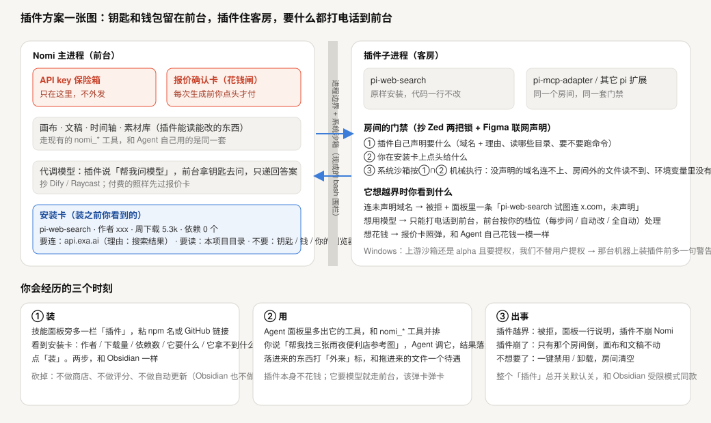

# 插件宿主方案：钥匙和钱包留在前台，插件住客房

> 状态：📋 方案待拍板 — 2026-09-14。**抄谁已经有答案，形状已经有一张图，但用户还没点头，一行代码没动。**
> 相关：[pi 生态四用例调研](2026-09-14-pi-ecosystem-gaps.md) · [TODO · 生态与插件](../TODO.md)

---

## 0. 这是在解决哪个真实摩擦

用户的原话是「用 pi 生态插件快速补齐基本能力，而不是重复造轮子」。
今天的处境是：**pi 生态有一百多个现成扩展（联网读网页、搜索、trace 导出…），我们一个都装不了。** 不是懒，是结构上装不了——pi 官方自己写死了「扩展 = 任意代码 + 完整系统权限 + 无签名无完整性校验」，而 Nomi 是**替用户保管 API key、替用户花真钱**的桌面应用。把一个能读 Chrome cookie 的 npm 包（`pi-web-access`，周下载 9.7 万）塞进我们的主进程，等于把别人的威胁模型搬进我们家。

于是每缺一个能力，我们就得自己再写一份。**这道题必须先解开，「补齐基本能力」才有路。**

**用户要权衡的那一个东西**：把第三方代码挪出主进程要一次真实的改造（Electron `utilityProcess` + 进程间协议），成本是**几天**；不做的话，插件生态这条路**永久关着**，每个能力都自研。所以真正的取舍不是「安不安全」——是「**现在花几天把房间隔出来，还是接受以后每个能力都自己写**」。

## 1. 结论：抄谁

调研了十一家（详见下面「调研全文」）。**只有两家真的解决了「宿主替用户保管 key + 插件要用模型」这道题，而且答案是同一个：**

- **Dify**：插件里只声明 `type: model-selector`，运行时 `self.session.model.llm.invoke()` 把调用**交还宿主**，插件全程碰不到 key。
- **Raycast**：`AI.ask()`，同一个答案的第二次独立发现。

两家撞在一起，这就不是巧合。**其余九家（含 Anthropic 自己的 Claude Desktop 与 Claude Code、VS Code、Obsidian、Cursor、Cline、Open WebUI）全是「子进程/同进程 + 全权限 + 官方明说不安全 + 把宝押在商店审查上」**——那套的前提是宿主自己不替用户花钱，我们有报价卡，这条路在我们这里价格不对。

三条越界结论，比「抄谁」更重要：

1. **manifest 不是闸。** Chrome / Figma / Zed 的清单之所以有用，是因为背后各有一层**机械执行**（浏览器 API 绑定 / 沙箱 realm 里根本没有 `fetch` / wasmtime 宿主的 Rust 双重检查）。VS Code 原话：扩展宿主「has the same permissions as VS Code itself」。**抄清单不抄执行层 = 抄了一张写着「我很安全」的纸。**
2. **钱这一格，没有一家做得比 Nomi 现在好。** 逐次报价卡在这一族里是**差异化不是补课**——只要守住「spend grant 只在主进程铸、插件够不到」这条不变量（`electron/spendGrant.ts:6-18` 已经是这个形状）。
3. **pi 生态已经长出权限层，但全部拦不住我们最怕的那一刀**：扩展的 factory 代码在 **load 那一刻就跑了**，早于任何 `tool_call` 钩子（09-07 探针实测：不注册任何工具也能读 env、发网络、写文件）。pi 上游**明确不修**（issue #6715 三条诉求 2026-07-16 全部 closed `not_planned`，官方 security 页写死「No Built-in Sandbox 是刻意的」）。**拦 factory 只剩两条路：装前审，或整进程 OS 沙箱。**

### 三样各抄一家

| 抄什么 | 抄谁 | 抄它要改的那一点 |
|---|---|---|
| **代调模型**（插件永远拿不到 key） | Dify 反向调用 / Raycast `AI.ask()` | **Dify 的插件是独立子进程，我们的 lane 在主进程。** 没有那道进程边界，「反向调用」只是个约定——插件代码和 key 在同一个堆里，一句 `process.env` 就绕过去。**这是整件事的前置条件。** |
| **两把锁**（清单声明 AND 用户授予，宿主机械校验） | Zed `[[capabilities]]` + `granted_extension_capabilities` | Zed 自己漏了 `http-client.fetch` 和 `worktree.shell-env()`——「读 env 里的 key 再外发」全程不用声明。对拿着用户 key 的我们这是致命漏法，**所以清单必须按 R21.3 数门覆盖宿主暴露的每一个 import，一个都不能漏**（就是 `check:framework-surface` 逐字段裁决的形状，把对象从框架字段扩到插件接触面）。 |
| **联网声明**（域名 + **写给用户看的理由**） | Figma `networkAccess{allowedDomains, reasoning}` | 我们围栏里 `allowedDomains` **已经存在且默认全拒**（`laneCodingSandbox.mts:55/206`），缺的只是「把清单接到围栏」那根线。但 Figma 靠「沙箱 realm 里根本没有 fetch」兜底，我们没有这层——**进程边界建起来之前，`allowedDomains` 拦得住插件 spawn 出去的 curl，拦不住插件自己 `await fetch()`。** |

## 2. 方案一张图

比喻：**钥匙和钱包留在前台，插件住客房，要什么都打电话到前台。**

- **前台（Nomi 主进程）**：API key 保险箱（只在这里）、报价确认卡（花钱闸）、画布/文稿/时间轴/素材库。插件说「帮我问模型」，前台拿钥匙去问，只把答案递回去；付费的照样先过报价卡。
- **客房（插件子进程）**：pi 扩展原样安装、代码一行不改。房间的门禁 = ① 插件自己声明要什么（域名 + 理由、读哪些目录、要不要跑命令）∩ ② 你在安装卡上点头给什么 → ③ 系统沙箱**机械执行**（没声明的域名连不上、房间外的文件读不到、环境变量里没有钥匙）。
- **越界时你看到什么**：连未声明域名 → 被拒 + 面板一行「pi-web-search 试图连 x.com，未声明」；想用模型 → 只能打电话到前台，按你的档位处理；想花钱 → 报价卡照弹。
- **三个时刻**：① **装**——技能面板旁多一栏「插件」，粘 npm 名或 GitHub 链接，看到安装卡（作者 / 下载量 / 依赖数 / 它要什么 / 它拿不到什么），点「装」，两步。**砍掉：不做商店、不做评分、不做自动更新**（Obsidian 也不做）。② **用**——它的工具和 `nomi_*` 并排出现在 Agent 面板，产物落素材库并打「外来」标。③ **出事**——越界被拒插件不崩 Nomi；插件崩了只有那个房间倒；一键禁用/卸载。整个「插件」总开关**默认关**（Obsidian 受限模式同款）。
- **明着标的缺口**（D4）：Windows 侧上游沙箱还是 alpha 且要一次提权安装，我们不替用户提权 → 那台机器上装插件前多一句警告，或先不开。

## 3. 待拍板 + 下一步

**待用户点头的两件**：① 抄这套（Dify 反向调用 + Zed 两把锁 + Figma 联网声明）对不对；② 值不值得为它先做「第三方代码挪出主进程」这次改造。

**点头后的第一步不是写产品代码，是一个零成本探针**：`utilityProcess` 子进程 + 反向调用跑通 + 挑两个真包（`pi-web-search` 零依赖、一个 MCP 适配器）实跑，验证「原样安装、代码不改」这句成不成立。探针红了，整套方案的形状要改。

**先查过的坑**（接任何远程沙箱方案前必读）：pi issue **#9068（open）**——执行路由扩展一挂，`user_bash` **静默回落宿主执行**。

## 4. 没核实的，明着标

- 各家机制多数来自官方文档与 README 自述，**源码只读了 Zed 与我们自己那部分**；标「未核实」的条目在分册里逐条标着。
- **纠正一处旧说法**：不是「Windows/Linux 暂无沙箱」——Linux（`apply-seccomp`）与 Windows（`srt-win.exe`）的 vendor 路径**都已接**（`laneCodingSandbox.mts:167-175`）；Windows 是上游 alpha + 要提权所以 `active:false`，**Linux 是否真跑通未核实**（只读码没跑）。
- 生态包的**实际行为**一个都没跑，只读了 registry 元数据、描述与依赖表。

---

# 调研全文（2026-09-14，只读，一行产品代码未动）

> 只读调研 · 2026-09-14 · 一行产品代码未动 · 用户原话「一定有人解决过类似的问题」，目的是**抄一家**不是自己设计
> 分册（全部带官方 URL + 抓取日期，凭记忆的一律标「未核实」）：
> [lane-0 Nomi 侧现状](plugin-trust-models/lane-0-nomi-constraints.md) · [lane-a Anthropic 宿主族](plugin-trust-models/lane-a-anthropic.md) · [lane-b 其它 AI 宿主](plugin-trust-models/lane-b-ai-hosts.md) · [lane-c 浏览器/设计/编辑器清单](plugin-trust-models/lane-c-manifests.md) · [lane-d 桌面应用族](plugin-trust-models/lane-d-desktop-apps.md) · [lane-e pi 生态有没有人做过](plugin-trust-models/lane-e-pi-ecosystem.md)
> 前置（不重做）：`docs/research/2026-09-07-pi-package-ecosystem.md`、`…-pi-extension-load-probe.md` —— pi 本体不做审批/沙箱/签名，扩展全权限跑，`pi-web-access` 读 Chrome cookie。

---

## 0. 一句话先答

**十一家里只有两家真的解决了这个问题，解法是同一个：Dify 的「反向调用」和 Raycast 的 `AI.ask()`——插件永远拿不到 key，它把「我要调模型」这件事交还给宿主，宿主去调。** 其余九家（含 Anthropic 自己的两个宿主）全是「子进程 + 明着告诉你这玩意能干任何事」，把安全压在**安装前的审查**和**每次调用的弹窗**上，而不是压在清单里。

三条越界结论，先放这里：

1. **manifest 不是闸。** Chrome、Figma、Zed 三家的清单之所以有用，是因为背后各有一层**机械执行**（浏览器 API 绑定 / CSP+无 DOM 的沙箱 realm / wasmtime 宿主的 Rust 双重检查）。VS Code、Raycast、Obsidian、Claude Code 的「清单」背后没有执行层，官方都自己写明了——VS Code 原话：扩展宿主「has the same permissions as VS Code itself」。**抄清单不抄执行层 = 抄了一张写着「我很安全」的纸。**
2. **钱这一项，没有一家做得比 Nomi 现在好。** Claude Desktop / Claude Code / Cursor / Cline 全都没有 spend 概念；OpenAI Apps SDK 里钱是开发者的不是用户的。**Nomi 的逐次报价卡在这一族里是差异化，不是补课**——只要守住「grant 只在主进程铸、插件够不到」这条不变量（`electron/spendGrant.ts:6-18` 已经是这个形状）。
3. **pi 生态已经长出权限层，但全部拦不住我们最怕的那一刀。** 现成包（`@gotgenes/pi-permission-system` 7549/周等）拦的都是 `tool_call`；而扩展的 **factory 代码在 load 那一刻就跑了**，早于任何钩子（我们 09-07 探针实测过：不注册任何工具也能读 env、发网络、写文件）。那个包 README 的 Non-goals 自己认了：「This is a decision layer — it decides and records; a sandbox contains.」**pi 上游明确不修**：issue #6715 要求的三条（告警 / 显式批准 / 扩展签名校验和）2026-07-16 全部 closed as `not_planned`，官方 `docs/security.md` 写死「No Built-in Sandbox 是刻意的」，并把「用户装的扩展和技能的行为」列在安全边界之外。

---

## 1. 总表

> 列：跑在哪 / key 到不到插件手 / 花钱可拦否 / 权限清单格式（RAW 字段）/ 拦截层 / 安装步数与提示文案。来源 URL 在各分册逐条标注，此表只给归属。

| 产品 | 跑在哪 | key 到不到插件手 | 花钱可拦否 | 权限清单（RAW 字段） | 拦截在哪一层 | 安装步数 / 用户看到的文案 | 分册 |
|---|---|---|---|---|---|---|---|
| **Claude Desktop 扩展（.mcpb，原 DXT）** | 本机**子进程** stdio，宿主自带 Node，**不沙箱** | **到手，但只是插件自己那份**：`${user_config.KEY}` → `mcp_config.env`，`sensitive:true` 的值存 OS keychain。宿主自己的 key 不给 | 无 spend 概念；per-call 授权弹窗的官方原文**未核实** | `user_config.<K>`: `type` / `title` / `description` / `required` / `default` / `multiple` / `sensitive` / `min` / `max` | 无执行层；只有安装期配置步骤 | 3 步（下载 → 双击 → Install）。注：`tools_generated:true` 官方承认服务器可在运行时长出新工具 | a |
| **Claude Code plugins / marketplace** | 本机**子进程**，官方逐字 **unsandboxed**，用户权限 | **env 注入**：非敏感 `${user_config.K}` 直接替换；敏感值走 `CLAUDE_PLUGIN_OPTION_<KEY>`；另有 `headersHelper` | 无 spend；但**工具调用可拦**：`permissions.allow/deny/ask` + `mcp__plugin_
_<s>__<tool>` + hooks | 插件侧**没有能力声明**，权限全在宿主 settings.json | 宿主策略层（per-call），不是清单 | 2 步（加市场 → install），官方市场 1 步。原文：插件「**can execute arbitrary code on your machine with your user privileges**」「**Anthropic doesn't control what MCP servers … are included in plugins**」 | a |
| **MCP 规范本身** | 不强制 | 只规定 OAuth；**MUST NOT** 透传 token | **SHOULD** human-in-the-loop，可逐次 deny | tool `annotations`——规范明写 **MUST 视为不可信** | 规范层（建议） | MUST 展示未截断的完整命令 | a |
| **Dify 插件** ⭐ | **独立子进程 + stdio JSON-RPC**（SaaS 走 Lambda，远程调试走 Redis 路由） | **不给 key。反向调用宿主**：`self.session.model.llm.invoke()`；插件 yaml 里声明 `type: model-selector`，**用户**在 Dify UI 挑模型。第三方 key 宿主代存，`self.runtime.credentials[...]` 注入 | **能**——模型调用必经宿主 | `resource` / `permission.{tool,model.{llm,text_embedding,rerank,tts,speech2text,moderation},node,endpoint,app,storage}` / `meta.runner.{language,version,entrypoint}` / `meta.arch` / `privacy`（上架必填） | 进程边界 + daemon 协议（未声明即拒；具体行为**未核实**） | Marketplace / GitHub / 本地 `.difypkg`。默认验签，装第三方报 `"plugin verification has been enabled, and the plugin you want to install has a bad signature"`，须显式 `FORCE_VERIFYING_SIGNATURE=false`；工作区可设 Everyone / Admins / No one | b |
| **Open WebUI Tools/Functions** | **宿主主进程内 `exec()`**（Pipelines 例外：独立 :9099 容器，已标 legacy） | 明文 Valves/UserValves，插件自己发请求 | **不能** | **无**。只有 docstring `title/author/version/requirements/license` | **没有** | 社区库 Get → 填实例 URL → Import；`requirements` 保存时直接 `pip install`。原文警告：`"Never import a Tool you don't recognize or trust. These are Python scripts and might run unsafe code on your host system."`「Malicious code can compromise your entire system.」 | b |
| **OpenAI Apps SDK** | **开发者自托管远端** MCP server（HTTPS streamable） | **从不给**；app 用自己的 OAuth 2.1+PKCE token 访问自己后端 | 能拦工具调用，但钱是开发者的 | MCP tool schema + OAuth `securitySchemes` scopes + resource CSP metadata | OAuth scope（无 scope → 401） | 连接时看开发者 IdP 同意屏（scopes）；审核细则**未核实** | b |
| **Cursor / Cline MCP** | 本机子进程 stdio 或远端 HTTP | `"env": {"API_KEY": "..."}` **明文注入** | 能：默认每次弹确认，`autoApprove` 白名单 | 无 | 宿主 per-call 弹窗 | 编辑 json；`disabled: true` 一键关 | b |
| **Chrome 扩展 MV3** | 独立扩展进程 / 内容脚本隔离世界 | n/a | n/a | `permissions` / `optional_permissions` / `host_permissions` / `optional_host_permissions` / `content_security_policy{extension_pages,sandbox}` | **浏览器运行时**：API 绑定 + CORS + CSP。最低 CSP `script-src 'self' 'wasm-unsafe-eval'` = 远程代码加载不了、`unsafe-eval` 安装即报错 | 2 步（Add to Chrome → Add extension）。逐条警告原文，如 `clipboardRead` = "Read data you copy and paste."、`proxy` = "Read and change all your data on all websites."。一键 Remove from Chrome；逐站点 on click / on specific sites / on all 三档 | c |
| **Figma 插件** ⭐ | **两界**：沙箱 realm（原文 "does not expose browser APIs"，无 `fetch`/DOM/`setTimeout`）+ 可选 iframe UI（有网络），postMessage 通信 | n/a | n/a | `networkAccess{allowedDomains, reasoning, devAllowedDomains}` / `permissions`（如 `"currentuser"`）/ `capabilities` / `documentAccess` | **两道运行时**：① CSP 拒连，错误原文 `Refused to connect to '...' because it violates ... "default-src data:"`，域名带路径粒度；`["*"]` 必须写 `reasoning`，**该理由对用户公开在 Community 页** ② 能力**不可达**（沙箱 realm 里根本没有 fetch）——比「权限被拒」更硬 | 无逐权限弹窗，只有四档标签（Unknown / Unrestricted / Restricted / No access to network，Restricted 可展开看域名） | c |
| **VS Code** | 扩展宿主独立进程，但**不沙箱** | `SecretStorage`（`context.secrets`，OS keyring 背书）；文档点名 `globalState`/`workspaceState` 明文是反模式 | n/a | `capabilities.untrustedWorkspaces`（`true`/`false`/`'limited'`）+ `restrictedConfigurations` + `enabledApiProposals` | **不执行**。官方原话：「The extension host has the same permissions as VS Code itself … any action that VS Code can perform, an extension can also perform.」官方 discussion：「there is no mechanism to prevent a malicious extension from executing your commands」「In the future we plan to investigate more into sandboxing extensions」 | 安全全压发布侧：全量签名 + 恶意软件扫描 + 封禁自动卸载 + verified publisher（DNS TXT，扩展与域名各满 6 个月）+ 1.97 起首装发布者信任弹窗（文案未核实）。全局开关 `security.workspace.trust.enabled`；`extensions.supportUntrustedWorkspaces` 允许用户**覆盖扩展自己的声明** | c |
| **Zed 扩展** ⭐ | **WASM**（wasmtime，`wasm32-wasip2`）；WASI 只 preopen 扩展自己的工作目录，无网络、不继承 env | 不能直接读（key 在系统 keychain，`get-settings` 类别白名单）；**但 `worktree.shell-env()` 未受能力门控**（源码核实）→ env 里的 key 会泄 | n/a | `extension.toml` 的 `[[capabilities]]`，`kind = "process:exec" / "download_file" / "npm:install"` + 用户侧 `granted_extension_capabilities` | **宿主 Rust 双重检查**（`CapabilityGranter`）：清单声明 **AND** 用户授予，两把锁都过才放行 | Gallery 一键装，**无权限弹窗**；人工评审在发布时。拒绝时返回 `result<_, string>`：`capability for process:exec … was not listed in the extension manifest` / `… is not granted by the extension host`。全局关断 `"granted_extension_capabilities": []` | d |
| **Raycast 扩展** ⭐ | 单个 Node 子进程，每扩展一个 v8 worker，官方原文「**not further sandboxed**」 | **`AI.ask()`——宿主代调模型，扩展一点 key 都没有**（Pro 限流 10/min、100/hr）。`preferences[].type:"password"` 存 Raycast 自家「local encrypted database」，**不是 keychain**（申请 Keychain Access 的扩展评审直接拒） | AI 工具可选 `Tool.Confirmation`（**开发者 opt-in**，非强制） | 无 permissions 字段；只有 `preferences` 数组 | **评审 + CI，运行时不拦** | Store 一键装 | d |
| **Obsidian** | 同进程，**不沙箱** | n/a | n/a | `manifest.json`（字段清单本轮**未核实**） | **没有**。官方原文：插件「inherit Obsidian's access levels」，可「access files on your computer」「connect to internet」「install additional programs」 | **受限模式默认开**，两步装（Install → Enable），**不自动更新**「for security purposes」，自动恶意扫描 + 安全评分卡。关闭受限模式时的 App 内逐字文案**未核实**（闭源） | d |

⭐ = 下一节点名的四家。

---

## 2. pi 生态：有没有人已经做过（lane-e 全文）

| 结论 | 证据 |
|---|---|
| 生态**已长出一整片**权限/沙箱扩展，不用从零造 | `@gotgenes/pi-permission-system` v32.0.2 / 7549 周下载；`pi-vetter`(106，用 `@sigstore/verify` + tarball 逐文件摘要 + TOCTOU 防护)；`@erichll/pi-sandbox`(627)、`pi-landstrip`(768) 均接 Anthropic `sandbox-runtime`；`@iota-policy/pi-extension`(4，hash-pinned bless) |
| **但没有一个拦得住 extension factory**——factory 在 load 时跑，早于任何 `tool_call` 钩子，而这些权限扩展自己也是同一个 jiti loader 装的普通扩展 | `pi-permission-system` README 的 Non-goals：「This is a decision layer — it decides and records; a sandbox contains.」 |
| 拦 factory 只剩两条路：**装前审** 或 **整进程 OS 沙箱** | 同上（lane-e §1） |
| pi 上游**明确不修** | issue #6715「Extensions auto-execute without approval」三条诉求（告警 / 显式批准 / 扩展签名校验和）2026-07-16 全部 closed `not_planned`；`https://pi.dev/docs/latest/security` 写「No Built-in Sandbox 是刻意的」，把用户装的扩展/技能行为列在安全边界外；`grep integrity|checksum|signature|verify packages.md` → 0 命中 |
| 三条可直接拿走的判据 | ① `pi-landstrip`：**批准永不绕过沙箱硬拒绝**（两层是 AND 不是 OR，和 Zed 同构）② `pi-secure-it`：两层互补（OS 沙箱管 bash + in-process guard 管它够不到的工具）③ `@bruschill`：审计时把「这个包是安全的」这类注释**算减分**（反提示注入） |
| 风险 | 生态无事实标准（最大者只占 pi 本体下载的 0.38%，`pi-permission-system` 至少 6 个 scope 的 fork），选谁都在赌个人维护者。另 **#9068（open）**：执行路由扩展一挂，`user_bash` **静默回落宿主执行**——接任何远程沙箱方案前必须先看这条 |
| 未核实 | B 类沙箱在 Electron 内嵌 pi 下是否可用；上述机制均来自 README 自述未读源码；`pi-mono` vs `pi` 哪个是现役仓库名（SECURITY.md 今天取不到） |

---

## 3. 和 Nomi 最像的是谁 / 为什么 / 抄它要改哪一点

> Nomi 的领域约束（lane-0 逐条核过代码）：Electron **主进程**持 key 且 Agent lane 也跑在主进程（无 utilityProcess 隔离）；花钱闸 = 主进程独占铸造的 spend grant，渲染层只拿不透明 `grantId`；工具闸已挂在 pi 的 `before_tool`/`after_tool`；OS 围栏 `@anthropic-ai/sandbox-runtime` 已在仓库里且**网络策略就是域名白名单、默认空即全拒**，但**今天没有任何声明式来源去填它**，且只包住 bash 工具的 `operations`、不包宿主进程。
> **需更正任务书一处**：任务书说「Windows/Linux 暂无沙箱」。代码里 Linux（`apply-seccomp`）与 Windows（`srt-win.exe`）的 vendor 路径**都已接**（`laneCodingSandbox.mts:167-175`）；真正的限制是 Windows 侧上游标 alpha 且要一次提权安装、我们不替用户提权，所以那台机器 `active:false`。Linux 是否真跑通**未核实**（本轮只读码没跑）。

**① 最像的是 Dify，抄它那一条「反向调用」。**
理由：只有 Dify 和 Nomi 同时满足三件事——宿主替用户保管多个供应商 key、插件真的需要调模型、宿主要对每次调用负责。它的答案是插件 yaml 里只声明 `type: model-selector`，运行时 `self.session.model.llm.invoke()` 把调用**交还宿主**，插件全程碰不到 key，于是「花钱必须经过报价卡」不是一条纪律，是一条**够不到的物理事实**。这和 Nomi 的 `spendGrant` 是同一条不变量的两半（grant 只在主进程铸 ←→ 模型调用只在主进程发）。
抄它要改的那一点：**Dify 的插件是独立子进程，Nomi 的 lane 跑在主进程。** 没有那道进程边界，「反向调用」只是个约定——插件代码和 key 在同一个堆里，一个 `process.env` 就绕过去了。所以抄 Dify 的前提是先把第三方代码挪出主进程（Electron 里就是 `utilityProcess` + stdio JSON-RPC，和 Dify local runtime 同构）。**在那之前，「插件能调模型」这句话在 Nomi 上是不成立的。**

**② 执行层最像的是 Zed，抄它的「两把锁」。**
理由：Zed 是这十一家里唯一把「清单声明」和「用户授予」都做成**宿主侧机械检查**的——`[[capabilities]]` 里没写，拒；用户 `granted_extension_capabilities` 里没给，也拒；两者是 AND。这正好是 Nomi 已有的形状（技能 `requested-capabilities` **只能收窄**宿主天花板，`skillManifestSchema.ts:112`），只差把第二把锁（用户授予）显式化。而 pi 生态的 `pi-landstrip` 独立得出了同一条（「批准永不绕过沙箱硬拒绝」），两处印证。
抄它要改的那一点：**Zed 的能力清单漏了 `http-client.fetch` 和 `worktree.shell-env()`——即「读 env 里的 key 再外发」全程不需要任何声明。** 对拿着用户 key 的我们，这个漏法是致命的。所以抄两把锁必须配 R21.3 数门：**清单要覆盖宿主暴露的每一个 import**，一个都不能漏（这正好是 `check:framework-surface` 逐字段裁决已有的形状，把它的对象从框架字段扩到插件接触面）。

**③ 网络这一格最像的是 Figma，抄 `networkAccess`，而且我们比它容易。**
理由：Figma 的 `networkAccess{allowedDomains, reasoning}` 和 Nomi 围栏里**已经存在**的 `allowedDomains`（`laneCodingSandbox.mts:55/206`，默认 `[]` 全拒）是同一个形状——缺的只是把清单里的声明接到围栏的那根线（今天全仓 4 处命中全在该文件内部，**没有任何东西去填它**）。而且我们比 Figma 强一档：Figma 靠浏览器 CSP，我们靠 OS 级 `sandbox-exec`/seccomp。另外 `reasoning` 那个字段值得照抄——**理由是写给用户看的、公开在商店页的**，正对 D4「缺口明着标」。
抄它要改的那一点：**Figma 的双界靠「沙箱 realm 里根本没有 fetch」这条不可达性兜底，我们没有这一层**——Nomi 的围栏只包 bash 工具的 `operations`，插件代码本身在主进程里有完整的 Node `fetch`。所以在进程边界建起来之前，`allowedDomains` 拦得住插件 `spawn` 出去的 curl，拦不住插件自己 `await fetch()`。**这条不改，manifest 就是那张写着「我很安全」的纸。**

**（反面，同样重要）不要抄谁**：Anthropic 自家两个宿主、VS Code、Obsidian、Raycast、Open WebUI——它们的共同形状是「子进程/同进程 + 全权限 + 官方明说不安全 + 把宝押在商店审查上」。那套的前提是**宿主自己没有替用户花钱**。Nomi 有报价卡，押审查这条路在我们这里价格不对。唯一值得从 Raycast 拿走的是 `AI.ask()`——它和 Dify 反向调用是同一个答案的第二个独立发现，两家撞在一起，这条就不是巧合了。
